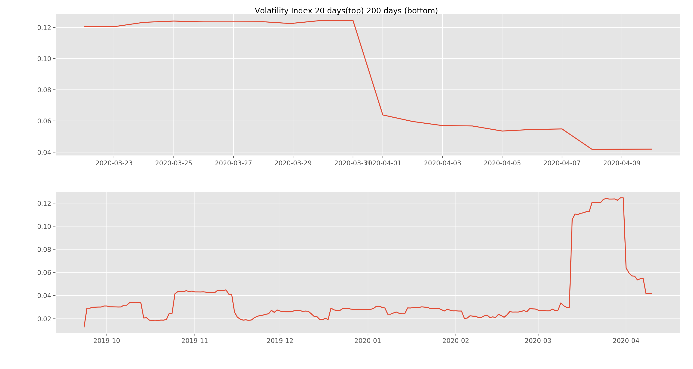
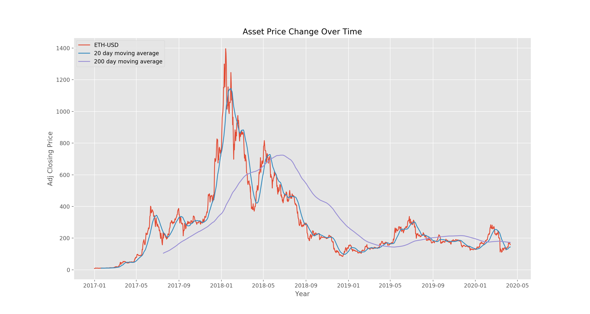
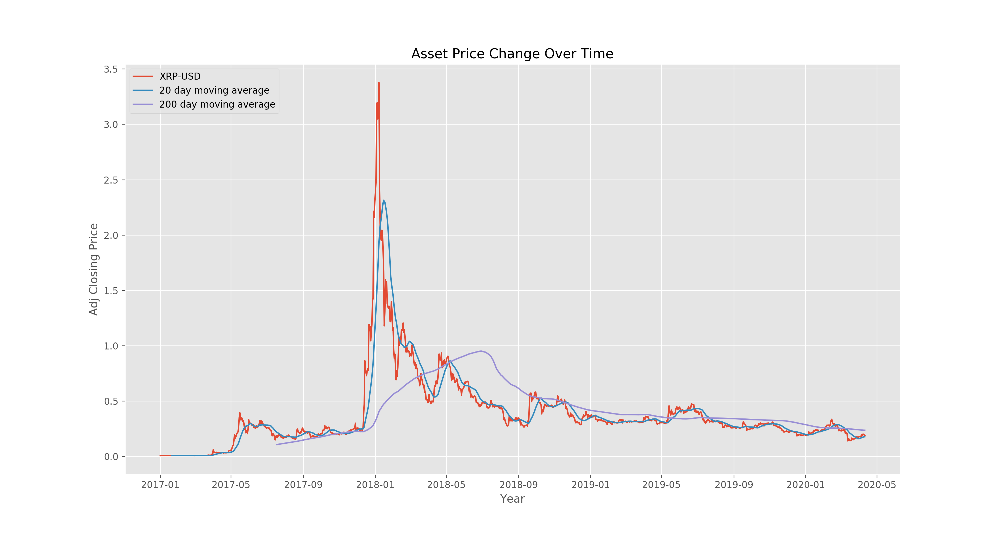
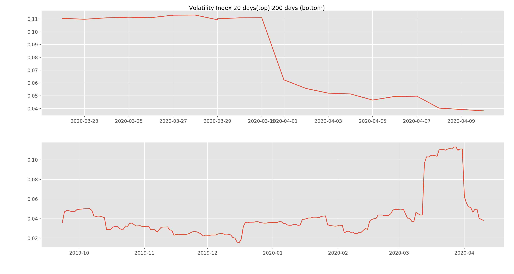

# Cryptocurrency Versus the Stock Market

Capstone Project
By Shaunil Maharaj

## Introduction

On January 25th, 2020, the Dow Jones traded above 20,000 for the first time, marking an important milestone in financial markets. Soon after, on February 5th, another important milestone was achieved for Bitcoin, having completed over 500 million transactions in it's 11 year history. The beginning of 2020 set expectations of a break out year for financial markets. Unfortunately, a deadly a viral outbreak had caused the US and World economies to come to a halt. In mid-March 2020, shelter in place orders and the forlough of non-essential employees began around the US, causing the assets market to take a price dive.

We will explore the performance of cryptocurrencies versus stock markets in order to gain insight on whether cryptocurrency can be seen as a worthy financial product. 

### Data

We will scrape historical pricing data from yahoo finance from the top 3 stock exchanges and the top 3 cryptocurrencies for the past 3 years. This data will then be scrubbed by filling missing values by front fill method and indexed for non-trading days if applicable to the assest as cryptocurrencies can be traded at anytime while stocks can be traded during banking hours.

### Data Description

The important features of our data will be the adjusted closing price and the volume by trade. The adjusted closing price is the asset's closing price, adjusted for stock splits or cryptocurrency halving and volume by trade reports the net amount of trade of that asset by volume. A price change column will be added to record the daily change in price over time.

The data will include all historical pricing information from January 1st 2017 to April 9th 2020. The stock market has data from decades past but cryptocurrencies are relatively new so we will only go back 3 years.

## Exporatory Data Analysis

### Dow Jones versus Bitcoin

### Dow Jones

The Dow Jones has performed well over the past 3 years. The 200 days moving average line indicates steady growth up until shelter-in-order began. After that, we see that volatility index skyrocket with correlations to the market crashing.

### Bitcoin

We see a giant bubble burst within bitcoin prices and subsequent recovery. This could be an indication that cryptocurrencies are highly speculative but this cryptocurrency in particular is once again showing strong recovery. We can cleary see that the volatility of price has gone done indicating that bitcoin may have already stabilized since COVID has halted the economy.

### Insights

As we can see, both markets are subject to speculation and volitivity, but bitcoin prices vary greatly. It seems to have gone through and amazing bubble at the end of 2017. It is interesting to note that the Dow Jones has experienced similiar highs and lows at near the same time of bitcoin. While price growth for bitcoin has been shakey, the coin has reacted well to COVID-19, in that prices have seemed to recover while stock prices have continued to fall, and on average, back to values not seen since early 2017. It would make sense, as cryptocurrencies will not be subject to the same woes as corporations will on the stock market as these companies may not be able to work or produce.

### NASDAQ versus Etherium

### NASDAQ

The NASDAQ, similiar to the Dow Jones, has performed very well overall but was severly impacted by COVID-19. Both 20 day and 200 day volatility indexes show sharp increases in changes to stock price around the time shelter-in-place orders were given.

### Etherium

Etherium has not recovered as well from the cryptocurrency bubble of early 2018. We have seen a steady decline in the price as time has gone on. Similiar to bitcoin, in that it has seemingly stabilized since COVID-19.

### Insights

NASDAQ interestingly enough was the first all electronic trading exchange. Investors from previous generations balked at this idea, stating that high frequency trading this allowed would cos markets to spiral out of control due to sheer speculation. The NASDAQ however, is still here, and showed strong gains over the past 3 years. Etherium was slated to follow bitcoin but did not recover in price as well as, showing a steady decrease in price since then. We can see that Etherium's bubble occured slightly after bitcoins, possibly showing the net effect of hyper speculation.

### S&P 500 versus XRP/Ripple

### S&P 500

The S&P index has gone through similiar market changes as the other two stock exchanges. Similiar 3 year growth, with a similiar nose dive corresponding to shelter-in-place orders. The volatility indexes also show the same patterns as the Dow Jones and NASDAQ.

### XRP/Ripple

XRP/Ripple has had very similiar performance to Etherium. Initially a bubble burst, then the average price seems to be winding down to zero. Not a great sign for the health of cryptocurrency, but strong recoveries show the power of having a commidity be able to react to the supply and demand of the market so quickly.

# Hypothesis Testing

We will Hypothesis test with the [Mann-Whitney U-test](https://en.wikipedia.org/wiki/Mann%E2%80%93Whitney_U_test) which will no make any distributional assumptions considering the distributions of our assets could be very complicated. We will adopt the **Null Hypothesis** that each cryptocurrency is equally likely to grow in price as it's respective stock exchange counterpart. The **Alternate Hypothesis** is that the stock exchanges are better places for investment because they have better growth. We will test each hypothesis to a threshold of **Threshold** = 0.05 for each category.

## Dow Jones versus Bitcoin

### 3 year growth
  
**Null Hypothesis**: Bitcoin is likely to grow in price less than the Dow Jones grows in price.

**Alternate Hypothesis**: Bitcoin is likely to grow in price greater than the Dow Jones grows in price.
  
  **Threshold** = 0.05
  
  **P Value** = 0.011
  
We accept the **Alternative**, the p value for this competition is less than our threshold, signifying that the long term potential of bitcoin growth over the Dow Jones.
 
 
### Short term growth (20 days)

**Null Hypothesis**: Bitcoin is likely to grow in price less than the Dow Jones grows in price.

**Alternate Hypothesis**: Bitcoin is likely to grow in price greater than the Dow Jones grows in price.
  
  **Threshold** = 0.05
  
  **P Value** = 0.601
  
We accept the **Null**, with great significance we can say that in the short term, Dow Jones will grow and will likely to out grow bitcoin.

### Longer term growth (200 days)

**Null Hypothesis**: Bitcoin is likely to grow in price less than the Dow Jones grows in price.
  
**Alternate Hypothesis**: Bitcoin is likely to grow in price greater than the Dow Jones grows in price.

  **Threshold** = 0.05
  
  **P Value** = 0.896
  
We accept the **Null** once again. Long term growth for the Dow Jones will surpass that of bitcoin.

## NASDAQ versus Etherium

### 3 year growth
  
**Null Hypothesis**: Etherium is likely to grow in price less than the NASDAQ grows in price.

**Alternate Hypothesis**: Etherium is likely to grow in price greater than the NASDAQ grows in price.
  
  **Threshold** = 0.05
  
  **P Value** = 0.414

We accept the **Null** because NASDAQ has outperformed Etherium in a 3 year period.
  
### Short term growth (20 days)

**Null Hypothesis**: Etherium is likely to grow in price less than the NASDAQ grows in price.

**Alternate Hypothesis**: Etherium is likely to grow in price greater than the NASDAQ grows in price.
  
  **Threshold** = 0.05
  
  **P Value** = 0.409

We once again accept the **Null**, in the short term stocks will still grow at a better rate.
  
### Longer term growth (200 days)

**Null Hypothesis**: Etherium is likely to grow in price less than the NASDAQ grows in price.

**Alternate Hypothesis**: Etherium is likely to grow in price greater than the NASDAQ grows in price.
  
  **Threshold** = 0.05
  
  **P Value** = 0.304

We have chosen **Null** for every category when comparing NASDAQ to Etherium coin. The trend is showing that traditional stock xchanges are outperforming cryptocurrencies.

## S&P 500 versus XRP/Ripple

### 3 year growth
  
**Null Hypothesis**: XRP/Ripple is likely to grow in price less than the S&P 500 grows in price.

**Alternate Hypothesis**: XRP/Ripple is likely to grow in price greater than the S&P 500 grows in price.
  
  **Threshold** = 0.05
  
  **P Value** = 0.013
  
We accept the **Null** for comparing 3 year growth p values of XRP/Ripple. XRP/Ripple did have the hardest time recovering from the crypto bubble so this falls in line with that.
  
### Short term growth (20 days)
  
**Null Hypothesis**: XRP/Ripple is likely to grow in price less than the S&P 500 grows in price.

**Alternate Hypothesis**: XRP/Ripple is likely to grow in price greater than the S&P 500 grows in price.
  
  **Threshold** = 0.05
  
  **P Value** = 0.484
  
We accept the **Null**, XRP performance however, was decent when in terms of recovery.
  
  
### Longer term growth (200 days)
  
**Null Hypothesis**: XRP/Ripple is likely to grow in price less than the S&P 500 grows in price.

**Alternate Hypothesis**: XRP/Ripple is likely to grow in price greater than the S&P 500 grows in price.
  
  **Threshold** = 0.05
  
  **P Value** = 0.414

We accept the **Null** once again, one could see a better profit from investing in the S&P instead of XRP.

# Conclusion

Financial markets are going through a though time right now much like the rest of the world due to the COVID pandemic. Economies of scale have been furloughed and production has been reduced dramatically. It is expected that financial markets will take a hit. A more surprising insight gained was the downward moving averages displayed by Etherium and XRP. The findings are very alarming as these crypto's are trending out of existence. A positive note for crypto is that there is evidence that could suggest the fast trading nature of cryptocurrencies allow them to bounce back quicker than traditional financial markets. Crypto's aren't bound by strict trading windows or other regulations that publicly traded stocks must adhere too.

Another positive take away is that all of the markets are showing some initial signs of stabilization. This brings hope, showing the economy can adapt and overcome despite the pandemic. It would be interesting to dive deeper into crypto metrics as well. Possible future projects could include more comparative analysis of crypto's versus individual companies, or a comparison with gold, silver, and oil.

